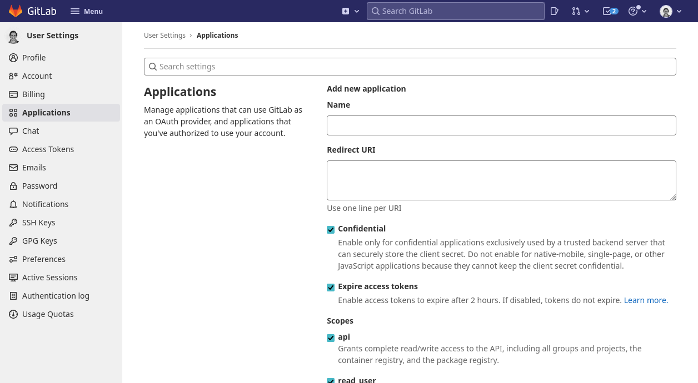
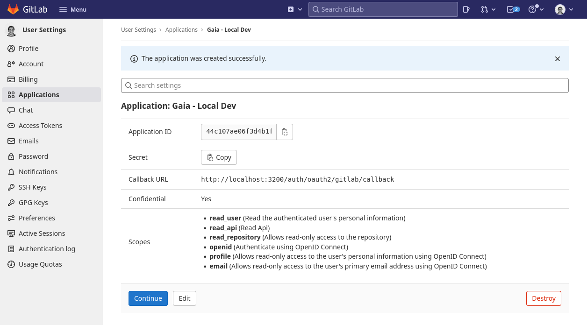
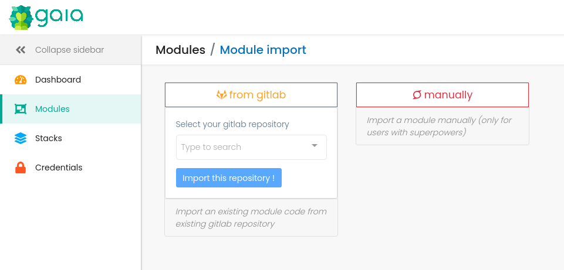

# Gitlab integration

This page describes how to configure Gaia to integrate with Gitlab to:

* be able to login using a Gitlab account
* be able to import Terraform modules directly from Gitlab

!!! note
    only **public** repositories of the Gitlab user can be imported for now.

## Create a Gitlab OAuth App

On Github, create a new Gitlab App (in an organization or in your personnal account).

Go to https://gitlab.com/-/profile/applications.



Enter the following information:

* Application name : Gaia
* Redirect URI : The URL of your Gaia instance + /auth/oauth2/gitlab/callback

Select the following scopes:

* api
* read_user
* read_api
* read_repository
* openid
* profile
* email

And save.

Take note of the _Application ID_ and of the _Secret_.



## Configure Gaia for Gitlab

### With docker-compose

Edit your `docker-compose.yml` file to activate the `gitlab` Spring profile, and to add your _Application ID_ and _Secret_ for the Gitlab registration :

```yaml
version: "3"
services:
  gaia:
    image: gaiaapp/gaia
    ports:
      - '8080:8080'
    environment:
      - "GAIA_MONGODB_URI=mongodb://mongo/gaia"
      - "GAIA_EXTERNAL_URL=http://172.17.0.1:8080"
      - "GAIA_RUNNER_API_PASSWORD=123456"
      - "SPRING_PROFILES_ACTIVE=gitlab"
      - "SPRING_SECURITY_OAUTH2_CLIENT_REGISTRATION_GITLAB_CLIENT_ID=<APPLICATION_ID>"
      - "SPRING_SECURITY_OAUTH2_CLIENT_REGISTRATION_GITLAB_CLIENT_SECRET=<SECRET>"
```

## Login with Gitlab

On the _Login_ page, the _gitlab_ button should appear:


## Import a module from Github

On the _Import Module_ page, you should now be able to select a module from the repositories of your Github user.

