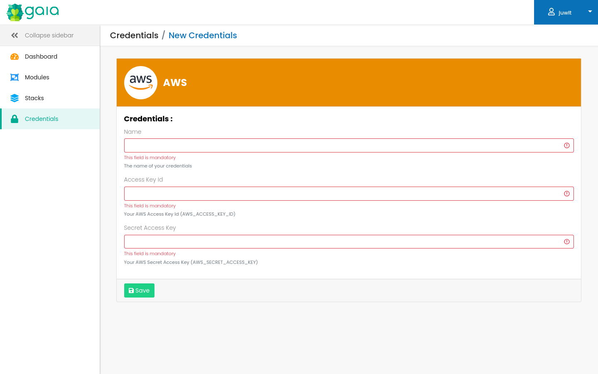

# AWS credentials

Gaia supports credentials for the AWS terraform provider.

The credentials are injected as environment variables in the runner.

The following fields are supported:

| credential field  | env var               | required |
|-------------------|-----------------------|----------|
| Access Key Id     | AWS_ACCESS_KEY_ID     | true     |
| Secret Access Key | AWS_SECRET_ACCESS_KEY | true     |

When using Vault integration, all the fields are encrypted. 

## Screenshots
AWS Credentials edition:

## Links
See [the terraform documentation](https://registry.terraform.io/providers/hashicorp/aws/latest/docs#environment-variables) for details about the AWS terraform provider authentication.