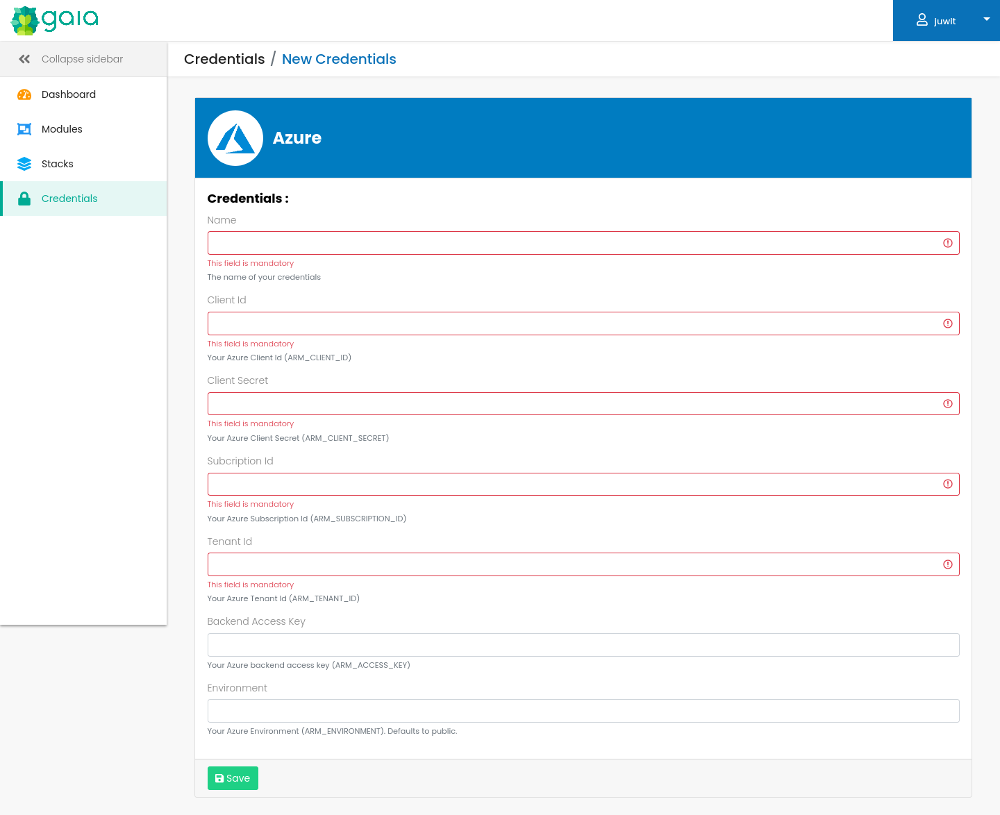

# AzureRM credentials

Gaia supports credentials for the AzureRM terraform provider.

The credentials are injected as environment variables in the runner.

The following fields are supported:

| credential field   | env var             | required |
|--------------------|---------------------|----------|
| Client Id          | ARM_CLIENT_ID       | true     |
| Client Secret      | ARM_CLIENT_SECRET   | true     |
| Subscription Id    | ARM_SUBSCRIPTION_ID | true     |
| Tenant Id          | ARM_TENANT_ID       | true     |
| Backend Access Key | ARM_ACCESS_KEY      | false    |
| Environment        | ARM_ENVIRONMENT     | false    |

When using Vault integration, all the fields are encrypted.

## Screenshots
AzureRM Credentials edition:

## Links
See [the terraform documentation](https://registry.terraform.io/providers/hashicorp/azurerm/latest/docs/guides/service_principal_client_secret#configuring-the-service-principal-in-terraform) for details about the AzureRM terraform provider authentication.