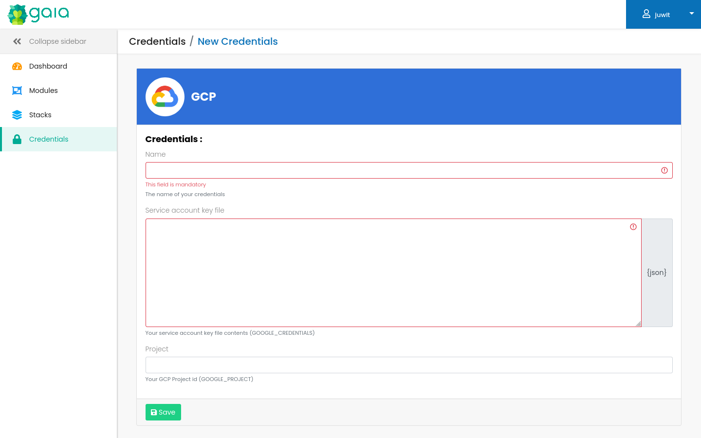

# GCP credentials

Gaia supports credentials for the Google terraform provider.

The credentials are injected as environment variables in the runner.

The following fields are supported:

| credential field         | env var            | required |
|--------------------------|--------------------|----------|
| Service Account Key File | GOOGLE_CREDENTIALS | true     |
| Project                  | GOOGLE_PROJECT     | false    |

When using Vault integration, all the fields are encrypted.

## Screenshots
GCP Credentials edition:

## Links
See [the terraform documentation](https://registry.terraform.io/providers/hashicorp/google/latest/docs/guides/provider_reference#full-reference) for details about the GCP terraform provider authentication.